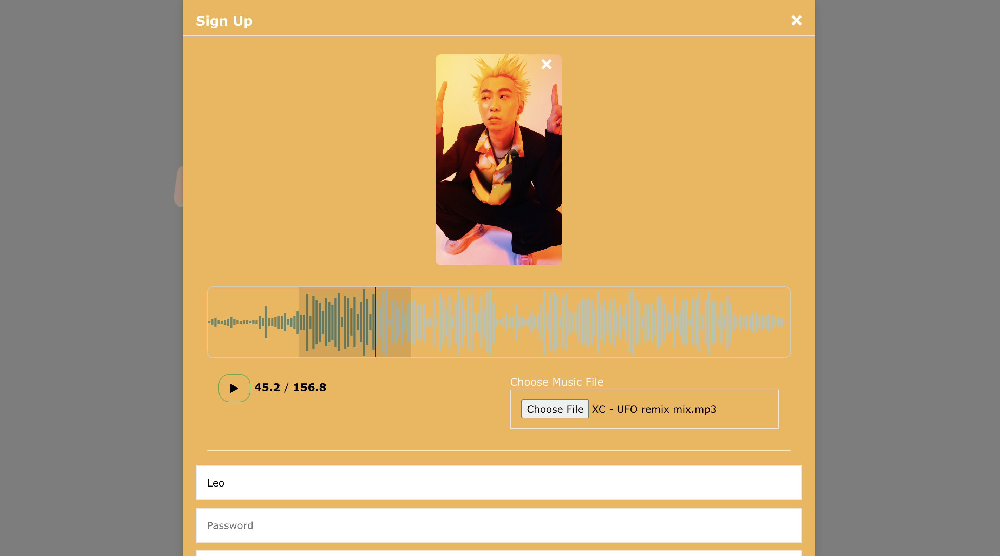
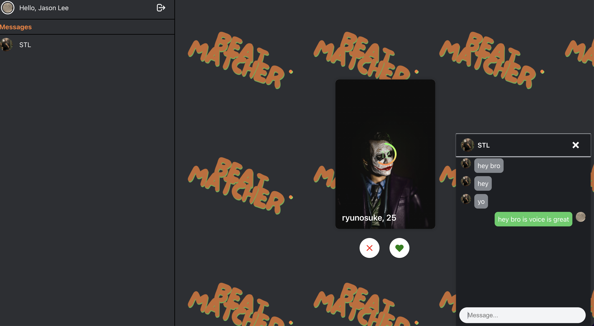

# BeatMatcher

BeatMatcher is a full stack application that connects songwriters with beatmakers, allowing them to find the most suitable match for their next collaboration. The app is developed using Node.js, HTML, CSS, and JavaScript, and is designed to be easy to use, with a modern, user-friendly interface.

**Note:** This project is still under development. The API has been updated to use an ORM design for better database management and interaction.

Link: https://beatmatcher-production.up.railway.app/

## Features

- A Tinder-style matching system that allows users to find the most suitable collaborator for their next project with 30 secs music clips.
- Real-time messaging and notifications using the socket.io framework, so users can communicate in real-time.
- Multer for file uploads, making it easy for users to share their work with others.
- In-app audio editing using Wavesurfer.js, which allows users to visually manipulate and edit audio files within the application.
- A MySQL database on AWS RDS for user account management, so users can easily create and manage their accounts.
- S3 for storage of files, ensuring that users' files are safe and secure.
- Deployed the application on a Railway cloud server for easy access and scalability

## Usage

To use the app, simply sign up for an account and start browsing for potential collaborators. Once you find someone you're interested in working with, you can message them in real-time and collaborate on your next project.
